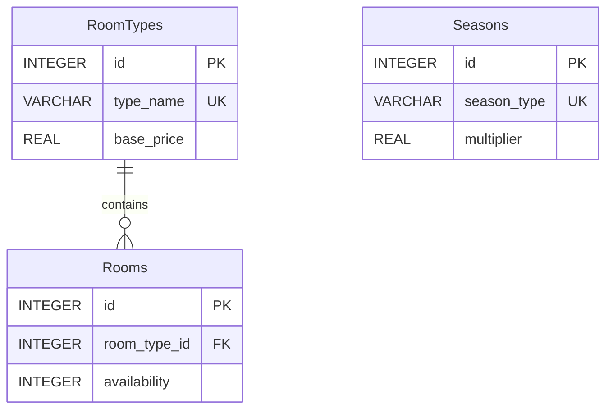

# Room Inventory Microservice


## Overview

The Room Inventory Microservice is a vital component of the Hotel Kong Arthur management system, designed to handle all room-related operations efficiently. It provides comprehensive APIs for room management, including room types, availability tracking, and pricing management. The service implements a seasonal pricing strategy and maintains a relational database structure for optimal data organization.

**Key Features:**
- Room type management with base pricing
- Room availability tracking
- Seasonal price adjustment system
- RESTful API endpoints
- Docker containerization

## Project Structure

```bash
RoomInventoryService/  
│  
├── csv/  
│   └── international_names_with_rooms_1000.csv  # Initial room data  
│  
├── db/  
│   ├── room_pricing.py                         # Room pricing constants
│   ├── connection.py                           # Database connection management
│   ├── initialize.py                           # Database initialization
│   ├── room_types.py                           # Room type operations
│   ├── rooms.py                                # Room operations
│   └── room_inventory.db                       # SQLite database  
│  
├── .dockerignore                               # Docker ignore rules  
├── .gitignore                                  # Git ignore rules  
├── app.py                                      # Main Flask application  
├── Dockerfile                                  # Docker configuration  
├── README.md                                   # Project documentation  
└── requirements.txt                            # Python dependencies  
```

The database module (`db/`) is organized into several Python modules for better separation of concerns:
- `room_pricing.py`: Contains room prices and seasonal mulitpliers
- `connection.py`: Handles database connection management
- `initialize.py`: Contains database initialization and setup functions
- `room_types.py`: Handles all room type-related database operations
- `rooms.py`: Handles all room-related database operations

## Prerequisites

- [Docker Desktop](https://www.docker.com/products/docker-desktop/)
- [Python 3.x](https://www.python.org/downloads/) (for local development)
- [Postman](https://www.postman.com/downloads/) (for testing)

## Installation

### Docker Setup (Recommended)
```bash
docker build -t room-inventory-service .
docker run -d -p 5002:5002 --name room-inventory-service room-inventory-service
```

### Local Development Setup
```bash
python3 -m venv .venv
source .venv/bin/activate
pip install -r requirements.txt
python app.py
```

## Database Schema




## API Documentation

| Method | Endpoint                     | Description             | Request Body                          | Response (200)                                                                                   | Error Responses                      |
|--------|-------------------------------|-------------------------|---------------------------------------|--------------------------------------------------------------------------------------------------|--------------------------------------|
| GET    | /api/v1/room_types            | Get all room types     | N/A                                   | `[{"id": 1, "type_name": "Standard Single", "base_price": 900}]`                                 | 404: `{"error": "No room types found"}` |
| GET    | /api/v1/room_type/{roomId}    | Get room type by ID    | N/A                                   | `{"id": 1, "type_name": "Standard Single", "base_price": 900}`                                   | 404: `{"error": "Room type not found"}` |
| POST   | /api/v1/room_type             | Add new room type      | `{"type_name": "Deluxe", "base_price": 1500}` | `{"message": "Room type added successfully"}`                                                 | 400: `{"error": "Missing required fields"}` |
| PATCH  | /api/v1/room_type/{roomId}/price | Update room price      | `{"base_price": 1600}`                | `{"message": "Price updated successfully"}`                                                     | 404: `{"error": "Room type not found"}` |
| GET    | /api/v1/rooms                 | Get all rooms          | N/A                                   | `[{"id": 1, "room_type_id": 1, "availability": 1, "type_name": "Standard Single", "base_price": 900}]` | 404: `{"error": "No rooms found"}`       |
| GET    | /api/v1/room/{roomId}         | Get room by ID         | N/A                                   | `{"id": 1, "room_type_id": 1, "availability": 1, "type_name": "Standard Single", "base_price": 900}` | 404: `{"error": "Room not found"}`       |
| PATCH  | /api/v1/room/{roomId}/availability | Update room availability| `{"availability": 0}`              | `{"message": "Room availability updated successfully"}`                                          | 404: `{"error": "Room not found"}`       |

## Room Types and Pricing System

The hotel implements a dynamic pricing system based on room types and seasonal demand. Each room type has a base price, which is adjusted using seasonal multipliers to optimize revenue based on demand patterns.

### Room Distribution (calculated from CSV file)

- Standard Single: 117 rooms (900 DKK)
- Grand Lit: 118 rooms (1100 DKK)
- Standard Double: 117 rooms (1200 DKK)
- Superior Double: 134 rooms (1400 DKK)
- Junior Suite: 136 rooms (1800 DKK)
- Spa Executive: 138 rooms (2000 DKK)
- Suite: 137 rooms (2500 DKK)
- LOFT Suite: 103 rooms (3000 DKK)

**Total Rooms: 1000**

### Seasonal Price Multipliers

```python
SEASONS = {
    'LOW': 0.8,
    'MID': 1.0,
    'HIGH': 1.2
}
```

## Testing

### Postman Collection

You can use the following API endpoints in Postman or any HTTP client to test the application.

#### 1. Get All Room Types
- **Method:** `GET`
- **Request:** `http://localhost:5002/api/v1/room_types`
- **Response Example:**
    ```json
    [
        {"id": 1, "type_name": "Standard Single", "base_price": 900},
        {"id": 2, "type_name": "Deluxe Suite", "base_price": 1500}
    ]
    ```

#### 2. Get Room Type by ID
- **Method:** `GET`
- **Request:** `http://localhost:5002/api/v1/room_type/1`
- **Response Example:**
    ```json
    {"id": 1, "type_name": "Standard Single", "base_price": 900}
    ```

#### 3. Add Room Type
- **Method:** `POST`
- **Request:** `http://localhost:5002/api/v1/room_type`
- **Request Body:**
    ```json
    {
        "type_name": "Supreme Deluxe",
        "base_price": 3000
    }
    ```
- **Response Example:**
    ```json
    {"message": "Room type added successfully"}
    ```

#### 4. Update Room Price
- **Method:** `PATCH`
- **Request:** `http://localhost:5002/api/v1/room_type/3/price`
- **Request Body:**
    ```json
    {
        "base_price": 1600
    }
    ```
- **Response Example:**
    ```json
    {"message": "Price updated successfully"}
    ```

#### 5. Get All Rooms
- **Method:** `GET`
- **Request:** `http://localhost:5002/api/v1/rooms`
- **Response Example:**
    ```json
    [
        {"id": 1, "room_type_id": 1, "availability": 1},
        {"id": 2, "room_type_id": 2, "availability": 0},
        {"id": 3, "room_type_id": 1, "availability": 0}
    ]
    ```

#### 6. Get Room by ID
- **Method:** `GET`
- **Request:** `http://localhost:5002/api/v1/room/10`
- **Response Example:**
    ```json
    {
        "id": 1,
        "room_type_id": 1,
        "availability": 1,
        "base_price": 900,
        "type_name": "Standard Single"
    }
    ```

#### 7. Update Room Availability
- **Method:** `PATCH`
- **Request:** `http://localhost:5002/api/v1/room/4/availability`
- **Request Body:**
    ```json
    {
        "availability": 0
    }
    ```
- **Response Example:**
    ```json
    {"message": "Room availability updated successfully"}
    ```

---

#### Created by Hotel Kong Arthur Team
