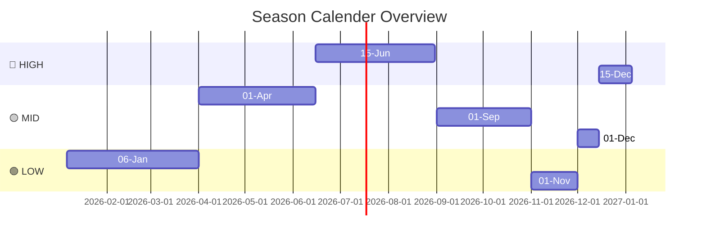
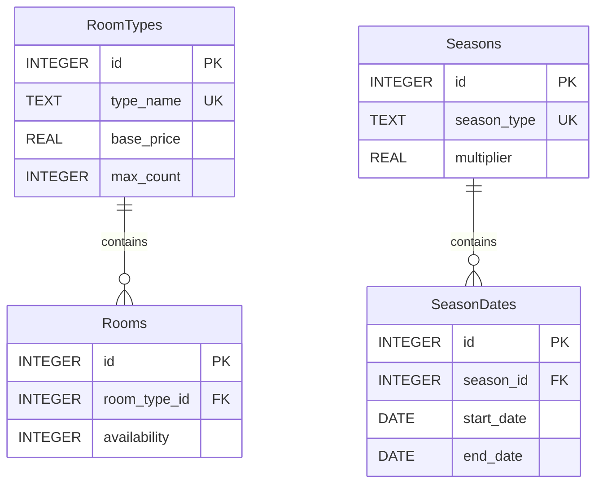

# Room Inventory Microservice


## Overview

The **Room Inventory Microservice** is a vital component of the **Hotel Kong Arthur** management system, designed to efficiently handle all room-related operations. Built using **Flask** and **SQLite**, it provides comprehensive APIs for room management, including room type definitions, real-time availability tracking, and room allocation. The service implements a modular architecture with separate layers for API routes, data repositories, and database operations.

### Key Features

- **Room Type Management**: Customizable maximum room counts for different room types.
- **Real-time Availability Tracking**: Monitor room availability dynamically.
- **Seasonal Pricing System**: Different pricing for various room categories based on seasons.
- **Room Allocation and Reservation Management**: Efficient handling of room bookings.
- **RESTful API Endpoints**: Comprehensive error handling and clear API structure.
- **SQLite Database**: Initialization scripts for database setup.
- **Docker Containerization**: Easy deployment and management of the microservice.
- **Modular Blueprint Architecture**: Enhanced maintainability and scalability.
- **Database Connection Pooling**: Improved database performance and resource management.


---

## Project Structure

```
RoomInventoryService/
├── csv/                             
│   └── international_names_with_rooms_1000.csv  # Initial room data
├── app.py                                       # Main application entry point
├── api/                                         # API routes for the application
│   ├── room_routes.py                           
│   ├── room_type_routes.py
│   ├── calculate_price_routes.py
├── repositories/                                # Data access layer with database operations
│   ├── room_repository.py                       
│   ├── room_type_repository.py
│   ├── calculate_price_repository.py
├── database/                                    # Database connection and initialization
│   ├── connection.py                            
│   ├── initialization.py                            
│   ├── constants.py                             
│   ├── room_inventory.db                        # SQLite database
├── Dockerfile                                   # Docker configuration file
├── requirements.txt                             # Python dependencies
└── README.md                                    # Project documentation
```

---

## Room Types and Distribution

| Room Type          | Number of Rooms | Base Price (DKK) |
|--------------------|-----------------|-------------------|
| Standard Single     | 50              | 900               |
| Grand Lit           | 50              | 1100              |
| Standard Double     | 40              | 1200              |
| Superior Double     | 25              | 1400              |
| Junior Suite        | 20              | 1800              |
| Spa Executive       | 15              | 2000              |
| Suite               | 10              | 2500              |
| LOFT Suite          | 4               | 3000              |
| **Total**           | **214**         |                   |

- **Standard Single**, **Grand Lit**, and **Standard Double** are the most numerous, representing accessible luxury options.
- **Superior Double** and **Junior Suite** have a moderate number of rooms.
- **Spa Executive**, **Suite**, and **LOFT Suite** are the least available due to their higher luxury status.

### Seasonal Pricing (LOW, MID, HIGH)

<!-- COMMENTED OUT
| Season | Date Range                          |
|--------|-------------------------------------|
| LOW    | January 6 - March 31, November 1 - November 30 |
| MID    | April 1 - June 14, September 1 - October 31, December 1 - December 14 |
| HIGH   | June 15 - August 31, December 15 - January 5 |




#### Season Rate Adjustment Description
- **LOW**: 20% discount - Lower rates during quieter months
- **MID**: Standard rate - Steady demand periods
- **HIGH**: 20% increase - Peak travel periods
---

## Database Schema



---

## API Documentation

| Method | Endpoint                                | Description                         | Request Body                                  | Response (200)                                   | Error Responses                                   |
|--------|-----------------------------------------|-------------------------------------|------------------------------------------------|--------------------------------------------------|--------------------------------------------------|
| GET    | /api/v1/room_types                     | Get all room types                  | N/A                                            | `[{"id": 1, "type_name": "Standard Single", "base_price": 900.0, "max_count": 50}]` | `404: {"error": "No room types found"}`        |
| GET    | /api/v1/room_types/availability        | Get room types with availability    | N/A                                            | `[{"id": 1, "type_name": "Standard Single", "base_price": 900.0, "available_count": 40, "max_count": 50}]` | `404: {"error": "No room types found"}`        |
| GET    | /api/v1/room_types/{roomId}            | Get room type by ID                 | N/A                                            | `{"id": 1, "type_name": "Standard Single", "base_price": 900.0, "max_count": 50}` | `404: {"error": "Room type not found"}`        |
| POST   | /api/v1/room_types                     | Add new room type                   | `{"type_name": "Deluxe", "base_price": 1500.0, "max_count": 10}` | `{"message": "Room type added successfully"}` | `400: {"error": "Missing required fields"}`   |
| PATCH  | /api/v1/room_types/{roomId}/price      | Update room price                   | `{"base_price": 1600.0}`                       | `{"message": "Price updated successfully"}`    | `404: {"error": "Room type not found"}`        |
| GET    | /api/v1/rooms                          | Get all rooms                       | N/A                                            | `[{"id": 1, "room_type_id": 1, "availability": 1, "type_name": "Standard Single", "base_price": 900.0}]` | `404: {"error": "No rooms found"}`             |
| GET    | /api/v1/rooms/{roomId}                 | Get room by ID                      | N/A                                            | `{"id": 1, "room_type_id": 1, "availability": 1, "type_name": "Standard Single", "base_price": 900.0}` | `404: {"error": "Room not found"}`             |
| PATCH  | /api/v1/rooms/{roomId}/availability     | Update room availability             | `{"availability": 0}`                          | `{"message": "Room availability updated successfully"}` | `404: {"error": "Room not found"}`             |
| GET    | /api/v1/rooms/{roomTypeId}/available   | Get first available room of type    | N/A                                            | `{"room_id": 42}`                             | `404: {"error": "No available rooms found"}`   |
| GET    | /api/v1/calculate_price/{roomTypeId}?start_date={start_date}&end_date={end_date} | Calculate total price for stay duration | N/A | `{"price": 2700.0, "season": {"id": 1, "season_type": "LOW", "start_date": "2024-01-06", "end_date": "2024-03-31"}}` | `404: {"error": "Room type not found"}, 400: {"error": "Missing field: start_date or end_date as query parameters"}` |
| GET    | /api/v1/calculate_price/season_type/{seasonId} | Get season name by ID             | N/A                                            | `{"id": 1, "season_type": "LOW", "multiplier": 0.8}` | `404: {"error": "Season not found"}`           |

## Testing

### Prerequisites
- **Docker Desktop**
- **Python 3.x** (for local development)
- **Postman** (for testing)

### Installation

#### Docker Setup (Recommended)
```bash
docker build -t room_inventory_service . && docker image prune -f
docker rm -f room_inventory_service && docker run -d -p 5002:5002 --name room_inventory_service --network microservice-network room_inventory_service
```

#### Local Development Setup
```bash
python3 -m venv .venv
source .venv/bin/activate
pip install -r requirements.txt
python3 app.py
```

### Postman Collection

You can use the following API endpoints in Postman or any HTTP client to test the application.

1. **Get All Room Types**
   - **Method:** `GET`
   - **Request:** `http://localhost:5002/api/v1/room_types`
   - **Response Example:**
     ```json
     [
         {"id": 1, "type_name": "Standard Single", "base_price": 900},
         {"id": 2, "type_name": "Deluxe Suite", "base_price": 1500}
     ]
     ```

2. **Get Room Types with Availability**
   - **Method:** `GET`
   - **Request:** `http://localhost:5002/api/v1/room_types/availability`
   - **Response Example:**
     ```json
     [
         {"id": 1, "type_name": "Standard Single", "base_price": 900, "available_count": 40, "max_count": 50},
         {"id": 2, "type_name": "Deluxe Suite", "base_price": 1500, "available_count": 5, "max_count": 10}
     ]
     ```

3. **Get Room Type by ID**
   - **Method:** `GET`
   - **Request:** `http://localhost:5002/api/v1/room_types/{roomId}`
   - **Response Example:**
     ```json
     {
         "id": 1,
         "type_name": "Standard Single",
         "base_price": 900,
         "max_count": 50
     }
     ```

4. **Add New Room Type**
   - **Method:** `POST`
   - **Request:** `http://localhost:5002/api/v1/room_types`
   - **Request Body:**
     ```json
     {
         "type_name": "Executive Suite",
         "base_price": 2000,
         "max_count": 5
     }
     ```
   - **Response Example:**
     ```json
     {
         "message": "Room type added successfully"
     }
     ```

5. **Update Room Price**
   - **Method:** `PATCH`
   - **Request:** `http://localhost:5002/api/v1/room_types/{roomId}/price`
   - **Request Body:**
     ```json
     {
         "base_price": 1600
     }
     ```
   - **Response Example:**
     ```json
     {
         "message": "Price updated successfully"
     }
     ```

6. **Get All Rooms**
   - **Method:** `GET`
   - **Request:** `http://localhost:5002/api/v1/rooms`
   - **Response Example:**
     ```json
     [
         {"id": 1, "room_type_id": 1, "availability": 1, "type_name": "Standard Single", "base_price": 900},
         {"id": 2, "room_type_id": 2, "availability": 0, "type_name": "Deluxe Suite", "base_price": 1500}
     ]
     ```

7. **Get Room by ID**
   - **Method:** `GET`
   - **Request:** `http://localhost:5002/api/v1/rooms/{roomId}`
   - **Response Example:**
     ```json
     {
         "id": 1,
         "room_type_id": 1,
         "availability": 1,
         "type_name": "Standard Single",
         "base_price": 900
     }
     ```

8. **Update Room Availability**
   - **Method:** `PATCH`
   - **Request:** `http://localhost:5002/api/v1/rooms/{roomId}/availability`
   - **Request Body:**
     ```json
     {
         "availability": 0
     }
     ```
   - **Response Example:**
     ```json
     {
         "message": "Room availability updated successfully"
     }
     ```

9. **Get First Available Room of Type**
   - **Method:** `GET`
   - **Request:** `http://localhost:5002/api/v1/rooms/{roomTypeId}/available`
   - **Response Example:**
     ```json
     {
         "room_id": 42
     }
     ```

10. **Calculate Total Price for Stay Duration**
    - **Method:** `GET`
    - **Request:** `http://localhost:5002/api/v1/calculate_price/{roomTypeId}?start_date={start_date}&end_date={end_date}`
    - **Response Example:**
      ```json
      {
          "price": 2700.0,
          "season": {
              "id": 1,
              "season_type": "LOW",
              "start_date": "2024-01-06",
              "end_date": "2024-03-31"
          }
      }
      ```

11. **Get Season Name by ID**
    - **Method:** `GET`
    - **Request:** `http://localhost:5002/api/v1/calculate_price/season_type/{seasonId}`
    - **Response Example:**
      ```json
      {
          "id": 1,
          "season_type": "LOW",
          "multiplier": 0.8
      }
      ```

---
