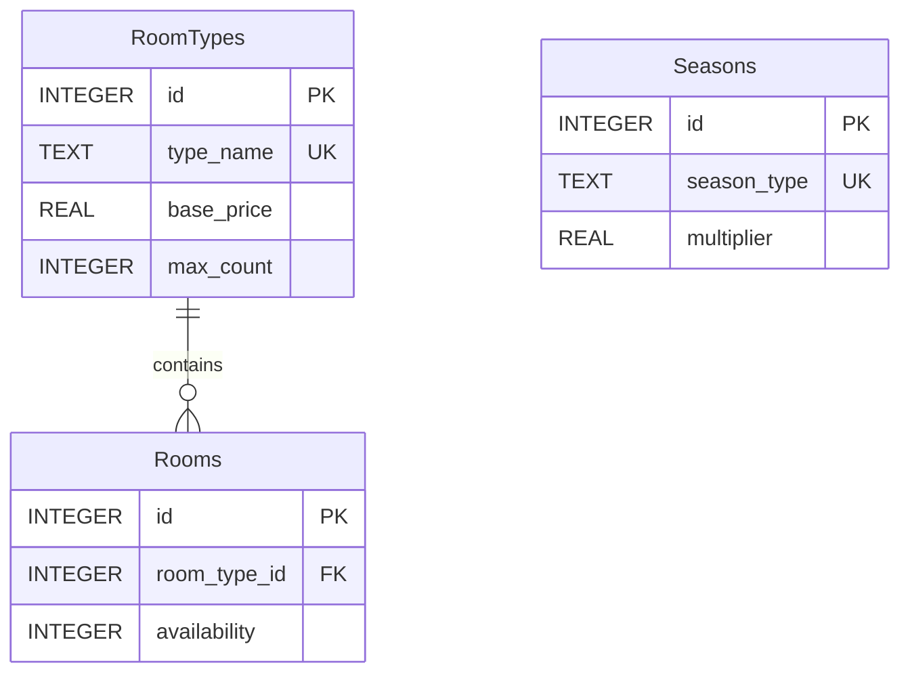

# Room Inventory Microservice


## Overview

The Room Inventory Microservice is a vital component of the Hotel Kong Arthur management system, designed to handle all room-related operations efficiently. Built using Flask and SQLite, it provides comprehensive APIs for room management, including room type definitions, real-time availability tracking, and room allocation. The service implements a modular architecture with separate layers for API routes, data repositories, and database operations.

**Key Features:**
- Room type management with customizable maximum room counts
- Real-time room availability tracking system
- Base pricing system for different room categories
- Room allocation and reservation management
- RESTful API endpoints with comprehensive error handling
- SQLite database with initialization scripts
- CSV data import support
- Docker containerization
- Modular Blueprint architecture
- Database connection pooling

## Project Structure

```bash
RoomInventoryService/
├── csv/                             
│   └── international_names_with_rooms_1000.csv  # Initial room data
├── app.py                                       # Main application entry point
├── api/                                         # API routes for the application
│   ├── room_routes.py                           
│   ├── room_type_routes.py                      
├── repositories/                                # Data access layer with database operations
│   ├── room_repository.py                       
│   ├── room_type_repository.py                  
├── database/                                    # Database connection and initialization
│   ├── connection.py                            
│   ├── initialization.py                            
│   ├── constants.py                             
│   ├── room_inventory.db                        # SQLite database
├── Dockerfile                                   # Docker configuration file
├── requirements.txt                             # Python dependencies
└── README.md                                    # Project documentation
```

## Database Schema



## Room Types and Distribution

The following table summarizes the distribution of room types based on the total bookings recorded. The hotel has a total of **214 rooms**, with varying amounts allocated to each type reflecting their luxury status and corresponding pricing.

| Room Type | Number of Rooms | Number of Bookings | Base Price (DKK) |
|-----------|----------------|-------------------|------------------|
| Standard Single | 50 | 117 | 900 |
| Grand Lit | 50 | 118 | 1100 |
| Standard Double | 40 | 117 | 1200 |
| Superior Double | 25 | 134 | 1400 |
| Junior Suite | 20 | 136 | 1800 |
| Spa Executive | 15 | 138 | 2000 |
| Suite | 10 | 137 | 2500 |
| LOFT Suite | 4 | 103 | 3000 |
| **Total** | **214** | **1,000** | |

- **Standard Single**, **Grand Lit**, and **Standard Double** are the most numerous, representing accessible luxury options.
- **Superior Double** and **Junior Suite** have a moderate number of rooms.
- **Spa Executive**, **Suite**, and **LOFT Suite** are the least available due to their higher luxury status.

## Seasonal Pricing (LOW, MID, HIGH)


---

## Seasonal Pricing Overview

The chart below shows rate adjustments aligned with hotel demand patterns in Copenhagen, Denmark. These seasonal rates help optimize pricing across low, mid, and high-demand periods.

| **Season**    | **Rate Adjustment**    | **Description**                        |
|---------------|------------------------|----------------------------------------|
| **LOW**       | 20% discount           | Lower rates during quieter months      |
| **MID**       | Standard rate          | Steady demand periods                  |
| **HIGH**      | 20% increase           | Peak travel periods                    |

---

### Season Date Ranges

| **Season**    | **Date Range**                  |
|---------------|---------------------------------|
| **LOW**       | January 6 - March 31            |
|               | November 1 - November 30        |
| **MID**       | April 1 - June 14               |
|               | September 1 - October 31        |
|               | December 1 - December 14        |
| **HIGH**      | June 15 - August 31             |
|               | December 15 - January 5         |


---

## API Documentation

| Method | Endpoint | Description | Request Body | Response (200) | Error Responses |
|--------|----------|-------------|--------------|----------------|-----------------|
| GET | /api/v1/room_types | Get all room types | N/A | `[{"id": 1, "type_name": "Standard Single", "base_price": 900.0, "max_count": 50}]` | 404: `{"error": "No room types found"}` |
| GET | /api/v1/room_types/availability | Get room types with availability | N/A | `[{"id": 1, "type_name": "Standard Single", "base_price": 900.0, "available_count": 40, "max_count": 50}]` | 404: `{"error": "No room types found"}` |
| GET | /api/v1/room_types/{roomId} | Get room type by ID | N/A | `{"id": 1, "type_name": "Standard Single", "base_price": 900.0, "max_count": 50}` | 404: `{"error": "Room type not found"}` |
| POST | /api/v1/room_types | Add new room type | `{"type_name": "Deluxe", "base_price": 1500.0, "max_count": 10}` | `{"message": "Room type added successfully"}` | 400: `{"error": "Missing required fields"}` |
| PATCH | /api/v1/room_types/{roomId}/price | Update room price | `{"base_price": 1600.0}` | `{"message": "Price updated successfully"}` | 404: `{"error": "Room type not found"}` |
| GET | /api/v1/rooms | Get all rooms | N/A | `[{"id": 1, "room_type_id": 1, "availability": 1, "type_name": "Standard Single", "base_price": 900.0}]` | 404: `{"error": "No rooms found"}` |
| GET | /api/v1/rooms/{roomId} | Get room by ID | N/A | `{"id": 1, "room_type_id": 1, "availability": 1, "type_name": "Standard Single", "base_price": 900.0}` | 404: `{"error": "Room not found"}` |
| PATCH | /api/v1/rooms/{roomId}/availability | Update room availability | `{"availability": 0}` | `{"message": "Room availability updated successfully"}` | 404: `{"error": "Room not found"}` |
| GET | /api/v1/rooms/{roomTypeId}/available | Get first available room of type | N/A | `{"room_id": 42}` | 404: `{"error": "No available rooms found"}` |

---

## Testing

### Prerequisites

- [Docker Desktop](https://www.docker.com/products/docker-desktop/)
- [Python 3.x](https://www.python.org/downloads/) (for local development)
- [Postman](https://www.postman.com/downloads/) (for testing)

### Installation

#### Docker Setup (Recommended)
```bash
docker build -t room_inventory_service . && docker image prune -f
docker rm -f room_inventory_service && docker run -d -p 5002:5002 --name room_inventory_service --network microservice-network room_inventory_service
```

#### Local Development Setup
```bash
python3 -m venv .venv
source .venv/bin/activate
pip install -r requirements.txt
python3 app.py
```

### Postman Collection

You can use the following API endpoints in Postman or any HTTP client to test the application.

#### 1. Get All Room Types
- **Method:** `GET`
- **Request:** `http://localhost:5002/api/v1/room_types`
- **Response Example:**
    ```json
    [
        {"id": 1, "type_name": "Standard Single", "base_price": 900},
        {"id": 2, "type_name": "Deluxe Suite", "base_price": 1500}
    ]
    ```

#### 2. Get Room Type by ID
- **Method:** `GET`
- **Request:** `http://localhost:5002/api/v1/room_types/{room_type_id}`
- **Response Example:**
    ```json
    {"id": 1, "type_name": "Standard Single", "base_price": 900}
    ```

#### 3. Add Room Type
- **Method:** `POST`
- **Request:** `http://localhost:5002/api/v1/room_types`
- **Request Body:**
    ```json
    {
        "type_name": "Supreme Deluxe",
        "base_price": 3000,
        "max_count": 5
    }
    ```
- **Response Example:**
    ```json
    {"message": "Room type added successfully"}
    ```

#### 4. Update Room Price
- **Method:** `PATCH`
- **Request:** `http://localhost:5002/api/v1/room_types/{room_type_id}/price`
- **Request Body:**
    ```json
    {
        "base_price": 1600
    }
    ```
- **Response Example:**
    ```json
    {"message": "Price updated successfully"}
    ```

#### 5. Get All Rooms
- **Method:** `GET`
- **Request:** `http://localhost:5002/api/v1/rooms`
- **Response Example:**
    ```json
    [
        {"id": 1, "room_type_id": 1, "availability": 1},
        {"id": 2, "room_type_id": 2, "availability": 0},
        {"id": 3, "room_type_id": 1, "availability": 0}
    ]
    ```

#### 6. Get Room by ID
- **Method:** `GET`
- **Request:** `http://localhost:5002/api/v1/rooms/{room_id}`
- **Response Example:**
    ```json
    {
        "id": 1,
        "room_type_id": 1,
        "availability": 1,
        "base_price": 900,
        "type_name": "Standard Single"
    }
    ```

#### 7. Update Room Availability
- **Method:** `PATCH`
- **Request:** `http://localhost:5002/api/v1/rooms/{room_id}/availability`
- **Request Body:**
    ```json
    {
        "availability": 0
    }
    ```
- **Response Example:**
    ```json
    {"message": "Room availability updated successfully"}
    ```

---

#### Created by Hotel Kong Arthur Team
