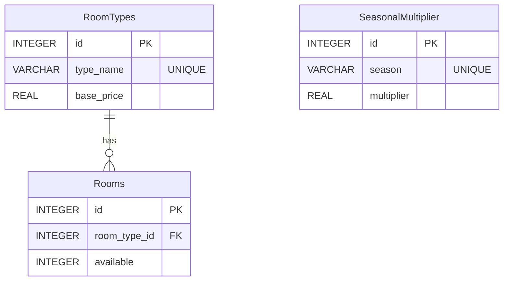

# Room Inventory Microservice


(Calculated from data set)
Room Type Counts:
Grand Lit: 118
Junior Suite: 136
LOFT Suite: 103
Spa Executive: 138
Standard Double: 117
Standard Single: 117
Suite: 137
Superior Double: 134
Total Rooms: 1000

## Overview

The Room Inventory Microservice is a vital component of the Hotel Kong Arthur management system, designed to handle all room-related operations efficiently. It provides comprehensive APIs for room management, including room types, availability tracking, and pricing management. The service implements a seasonal pricing strategy and maintains a relational database structure for optimal data organization.

Key functionalities:
- Room type management with base pricing
- Room availability tracking
- Seasonal price adjustment system
- RESTful API endpoints for seamless integration
- Docker containerization for consistent deployment

## Project Structure

```
RoomInventoryService/
│
├── csv/
│   └── international_names_with_rooms_1000.csv  # Initial room data
│
├── db/
│   ├── db.py                                    # Database operations
│   └── room_inventory.db                        # SQLite database
│
├── .dockerignore                                # Docker ignore rules
├── .gitignore                                   # Git ignore rules
├── app.py                                       # Main Flask application
├── Dockerfile                                   # Docker configuration
├── README.md                                    # Project documentation
└── requirements.txt                             # Python dependencies
```

## Prerequisites

Before running the service, ensure you have:

- [Docker Desktop](https://www.docker.com/products/docker-desktop/)
- [Python 3.x](https://www.python.org/downloads/) (for local development)
- [Postman](https://www.postman.com/downloads/) (for testing)

## Installation

### Docker Setup (Recommended)

1. Build the Docker image:
```bash
docker build -t room-inventory-service .
```

2. Run the container:
```bash
docker run -d -p 5002:5002 --name room-inventory-service room-inventory-service
```

### Local Development Setup

1. Create and activate virtual environment:
```bash
python -m venv venv
source venv/bin/activate  # On Windows: venv\Scripts\activate
```

2. Install dependencies:
```bash
pip install -r requirements.txt
```

3. Run the application:
```bash
python app.py
```

## Database Schema



## API Documentation

| Method | Endpoint | Description | Request Body Example | Response Example |
|--------|----------|-------------|---------------------|------------------|
| GET | `/api/v1/room-types` | Get all room types | N/A | `[{"id": 1, "type_name": "Standard Single", "base_price": 900}]` |
| GET | `/api/v1/room-types/<id>` | Get room type by ID | N/A | `{"id": 1, "type_name": "Standard Single", "base_price": 900}` |
| POST | `/api/v1/room-types` | Add new room type | `{"type_name": "Deluxe", "base_price": 1500}` | `{"message": "Room type added successfully"}` |
| GET | `/api/v1/rooms` | Get all rooms | N/A | `[{"id": 1, "type_name": "Standard Single", "base_price": 900, "available": "True"}]` |
| GET | `/api/v1/rooms/<id>` | Get room by ID | N/A | `{"id": 1, "type_name": "Standard Single", "base_price": 900, "available": "True"}` |
| POST | `/api/v1/rooms` | Add new room | `{"room_type_id": 1}` | `{"message": "Room added successfully"}` |

## Testing with Postman

1. Open Postman and create a new collection named "Room Inventory Service"

2. Add the following requests:

### Get All Room Types
- Method: GET
- URL: `http://localhost:5002/api/v1/room-types`
- Expected Response: Array of room type objects

### Get Room Type by ID
- Method: GET
- URL: `http://localhost:5002/api/v1/room-types/1`
- Expected Response: Single room type object

### Add New Room Type
- Method: POST
- URL: `http://localhost:5002/api/v1/room-types`
- Headers: `Content-Type: application/json`
- Body (raw JSON):
```json
{
    "type_name": "Deluxe Suite",
    "base_price": 1500
}
```
- Expected Response: Success message

### Get All Rooms
- Method: GET
- URL: `http://localhost:5002/api/v1/rooms`
- Expected Response: Array of room objects

### Get Room by ID
- Method: GET
- URL: `http://localhost:5002/api/v1/rooms/1`
- Expected Response: Single room object

### Add New Room
- Method: POST
- URL: `http://localhost:5002/api/v1/rooms`
- Headers: `Content-Type: application/json`
- Body (raw JSON):
```json
{
    "room_type_id": 1
}
```
- Expected Response: Success message

## Base Prices and Seasonal Multipliers

The service implements a flexible pricing system with base prices for different room types and seasonal multipliers:

### Room Type Base Prices
```python
BASE_PRICES = {
    'Standard Single': 900,
    'Grand Lit': 1100,
    'Standard Double': 1200,
    'Superior Double': 1400,
    'Junior Suite': 1800,
    'Spa Executive': 2000,
    'Suite': 2500,
    'LOFT Suite': 3000,
}
```

### Seasonal Price Multipliers
```python
SEASONAL_MULTIPLIERS = {
    'LOW': 0.8,    # 20% discount
    'MID': 1.0,    # Standard price
    'HIGH': 1.2,   # 20% premium
}
```

---

Created by Hotel Kong Arthur Team